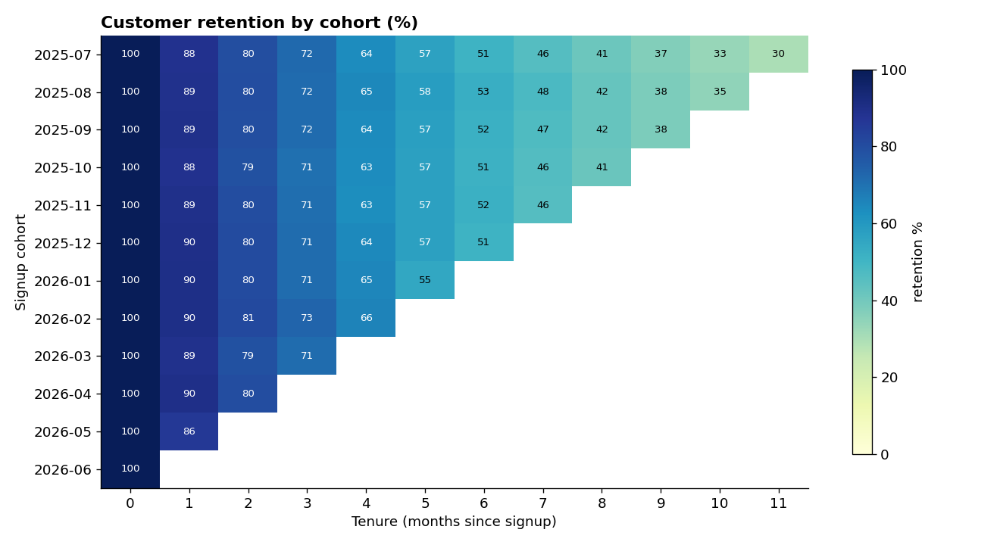
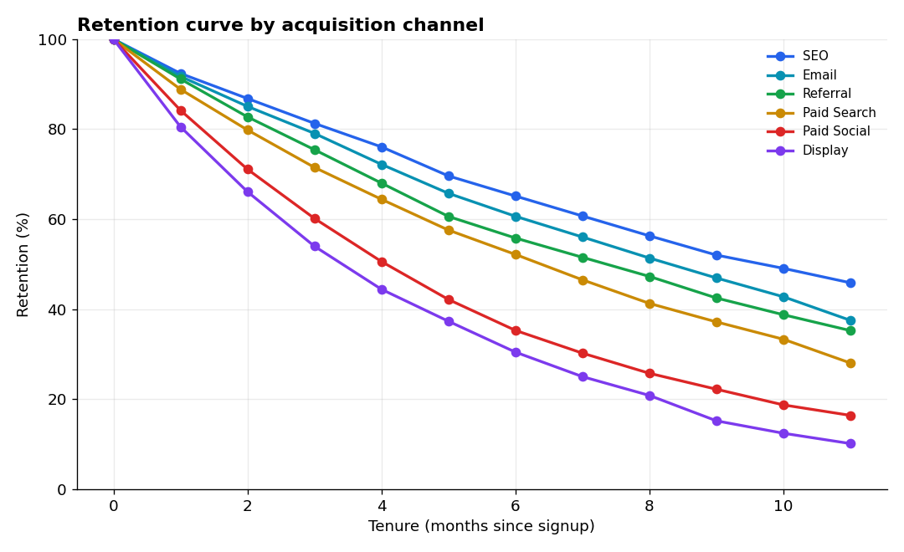
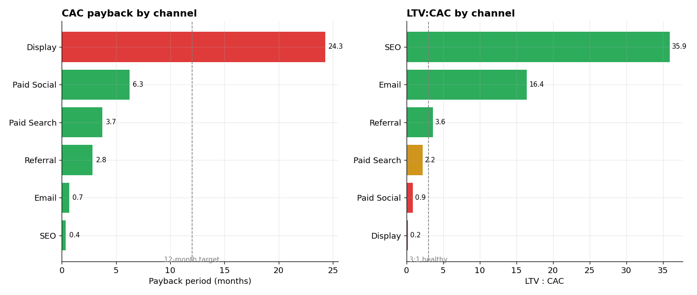
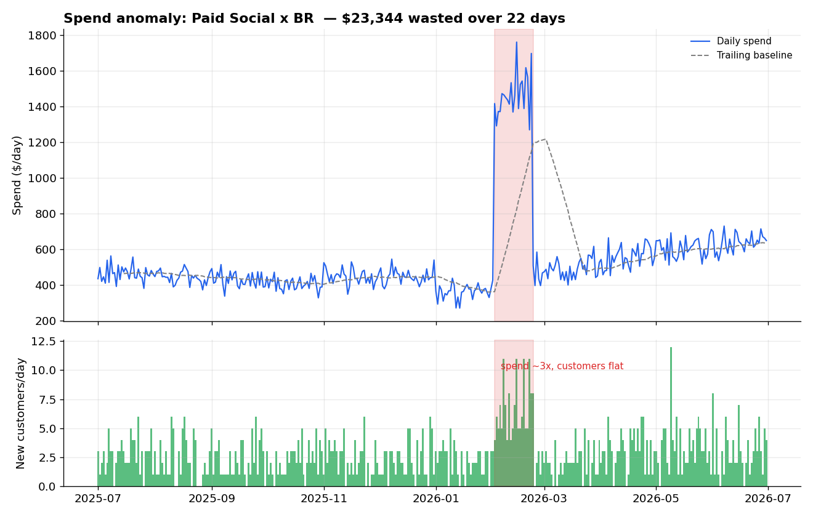
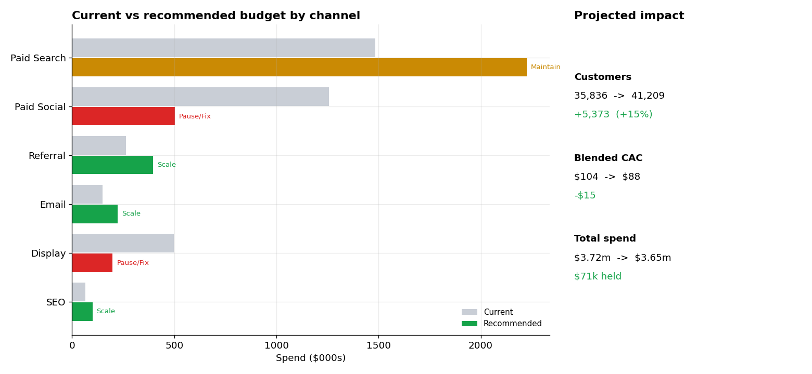
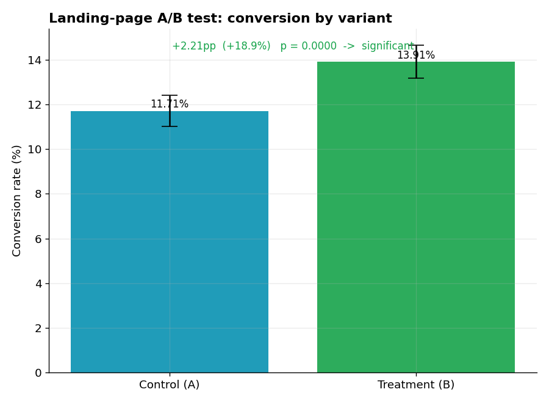
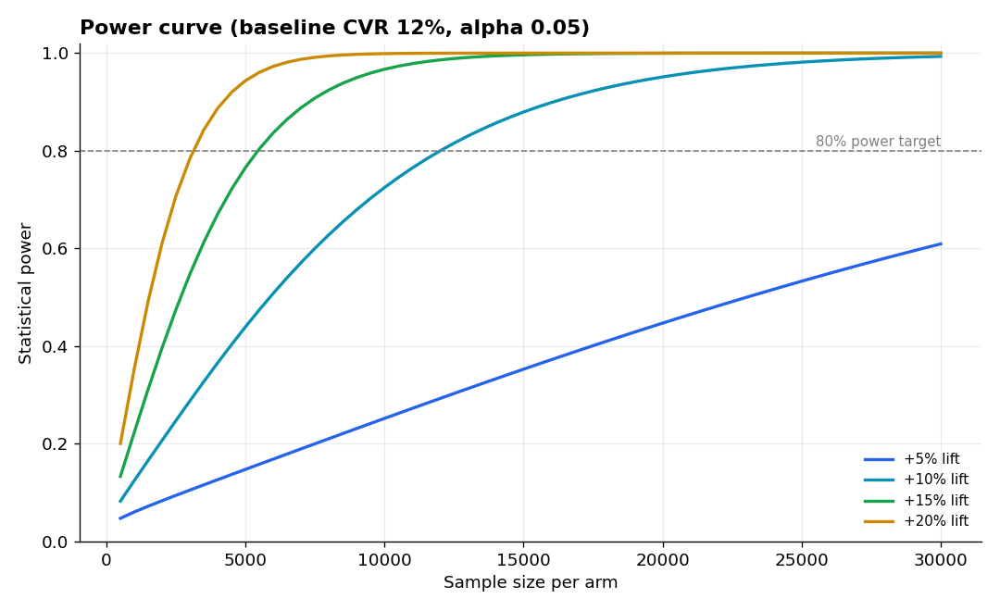
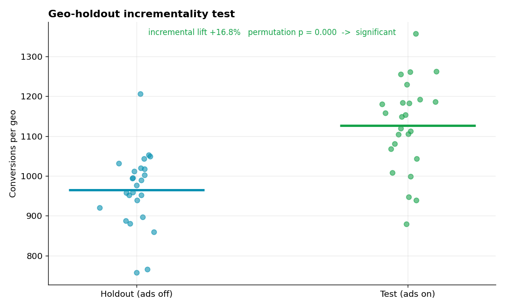

# Marketing Analytics & Attribution


End-to-end **marketing / growth analytics** on a realistic multi-market
acquisition dataset: channel performance, unit economics (CAC / ROAS / LTV),
multi-touch attribution, retention & payback, budget optimisation, anomaly
detection and experimentation — with the analysis run in both **Python** and
**SQL**, and an executive **Streamlit** dashboard on top.

The guiding principle is a commercial one: **optimise for revenue and payback,
not vanity metrics**. Every metric here ladders up to "where should the next
marketing dollar go?"

> Data is synthetic but fully reproducible (`generate_data.py`, fixed seed) and
> built with realistic economics — including a deliberately planted spend
> anomaly for the anomaly-detection work.

---

## Key results at a glance

The analysis of a full year (~$3.7m spend, ~35.8k customers) turns into one
recommendation and a set of decision-useful findings:

- 💰 **Budget reallocation: +15% customers at the same spend.** A budget-neutral
  plan (trim the loss-makers, fund the efficient channels within realistic caps)
  is projected to lift customers **35.8k → 41.2k** and cut **blended CAC $104 → $88**.
- 📊 **The blended 1.30 ROAS is a mirage.** Four of six channels are below
  break-even; SEO (13.3×) and Email (6.8×) carry the average yet get <6% of spend.
- 🎯 **Last-touch attribution is provably biased** — it over-credits Paid Search
  by **+46%** and under-credits Display by **−79%** vs a data-driven Markov model.
- ⏱ **Display never pays back:** a 24-month CAC payback against a ~9-month
  customer lifetime (LTV:CAC 0.2) — a stop, not a discount.
- 🚨 **Anomaly detection caught $23k of wasted spend** — a 22-day Brazil Paid
  Social overspend (~3× baseline, flat conversions) found with no prior knowledge.
- 🧪 **Incrementality ≠ attribution:** a geo-holdout test shows only ~14% of
  test-region conversions were truly ad-caused (incremental CAC ~7× the naive figure).

*(Full method and charts for each finding are in the day-by-day sections below.)*

---

## The business

A subscription / affiliate business that acquires users across six channels
(**Paid Search, Paid Social, Display, Email, SEO, Referral**) in five markets
(**UK, US, DE, BR, IN**). Users who activate pay a recurring monthly commission,
so each channel has both an acquisition cost and a downstream lifetime value.

### Dataset (`data/`)

| Table | Grain | Key fields |
|-------|-------|-----------|
| `spend.csv` | day × channel × country × campaign | spend, impressions, clicks |
| `users.csv` | one acquired user | signup date, country, channel, converted, months_active, commission_revenue, ltv |
| `touchpoints.csv` | one marketing touch | user_id, seq, channel, touch_date |

Users are generated **from** the paid clicks, so cost-per-acquisition and ROAS
are internally consistent rather than arbitrary.

---

## Day 1 — Channel performance (Objective 1)

*Where is the money going, and what is it bringing back?*


**Channel summary** (full year — see [`images/channel_summary.csv`](images/channel_summary.csv)):

| Channel | Spend | Customers | CAC | Revenue | ROAS |
|---|--:|--:|--:|--:|--:|
| SEO | $66k | 5,279 | $13 | $882k | **13.3** |
| Email | $149k | 6,252 | $24 | $1.01m | **6.8** |
| Referral | $264k | 3,120 | $85 | $424k | 1.6 |
| Paid Search | $1.48m | 12,223 | $121 | $1.72m | 1.16 |
| Paid Social | $1.26m | 7,959 | $158 | $749k | 0.60 |
| Display | $497k | 1,003 | $496 | $69k | 0.14 |

**Blended:** ~$3.7m spend → ~$4.8m revenue, **1.30 ROAS**, ~$104 CAC across 35.8k paying customers.

**What stands out**

- **The budget is upside-down.** The two highest-return channels — SEO (13.3×)
  and Email (6.8×) — receive under 6% of spend combined, while Display and Paid
  Social (both below the 1.0 break-even line) absorb nearly half of it.
- **Display is loss-making**: a $496 CAC against a ~$90 lifetime value. A clear
  pause / rework candidate (revisited on Day 5).
- **Paid Social underperforms (0.60 ROAS)** — and part of that is a Brazil spend
  spike that never converted, surfaced later by the Day 5 anomaly detector.
- **Paid Search is the workhorse**: the largest volume of customers, at an
  acceptable-but-thin 1.16 ROAS — a margin-optimisation opportunity, not a cut.
- By market, **US and UK** clear break-even comfortably while **BR and IN** sit
  below it — a multi-market efficiency gap to unpack.

The same analysis is expressed in SQL in [`sql/queries.sql`](sql/queries.sql)
(run via `sql_analysis.py`), with results saved to `sql_output/`.

---

## Day 2 — Unit economics (Objective 2)

*What does a customer cost, what are they worth, and where is that math broken?*

Building on Day 1, `unit_economics.py` adds the metrics a growth team steers on —
**CAC, ROAS, ARPC** (avg revenue per customer) and **LTV:CAC** — cut by channel,
by market, and by channel × market, each benchmarked against the blended average.
The same views are defined in SQL ([`sql/unit_economics_views.sql`](sql/unit_economics_views.sql), run via `sql_views.py`).

**Unit economics by channel** (see [`images/unit_economics_by_channel.csv`](images/unit_economics_by_channel.csv)):

| Channel | Spend | Customers | CAC | ARPC | Avg LTV | LTV:CAC | ROAS |
|---|--:|--:|--:|--:|--:|--:|--:|
| SEO | $66k | 5,279 | $13 | $167 | $452 | **35.9** | 13.3 |
| Email | $149k | 6,252 | $24 | $161 | $391 | **16.4** | 6.8 |
| Referral | $264k | 3,120 | $85 | $136 | $307 | 3.6 | 1.6 |
| Paid Search | $1.48m | 12,223 | $121 | $140 | $272 | 2.2 | 1.16 |
| Paid Social | $1.26m | 7,959 | $158 | $94 | $142 | 0.9 | 0.60 |
| Display | $497k | 1,003 | $496 | $69 | $98 | **0.2** | 0.14 |

**Blended:** CAC ~$104 · ROAS 1.30 · **LTV:CAC 2.78**.


**What stands out**

- **Realised ROAS and lifetime LTV:CAC tell different stories — both matter.**
  Referral and Paid Search look marginal on realised ROAS (1.6 and 1.16) but
  clear a healthy LTV:CAC (3.6 and 2.2) once the *full* customer lifetime is
  counted. Judging paid channels on first-order ROAS alone would wrongly cut
  them; judging on LTV:CAC alone would ignore cash-flow timing (payback, Day 4).
- **The blended 1.30 ROAS is a mirage.** Four of six channels sit *below*
  break-even; the average is propped up by SEO and Email. A single blended KPI
  would completely hide where the money is actually made or lost.
- **The efficiency frontier frames the reallocation.** SEO and Email are cheap
  *and* healthy but low-volume (room to scale); Paid Search is the high-volume
  workhorse; Paid Social is a large, low-health spend; Display is a low-volume,
  loss-making dead-end.
- **Market gap:** US/UK acquire at ~$91–95 CAC and >3.5 LTV:CAC, while **BR and
  IN** run at $129–145 CAC and fall *below* a 1.0 LTV:CAC — losing money on
  every customer.
- **CAC hides in the cross-section.** The channel × market heatmap
  ([`images/cac_channel_country_heatmap.png`](images/cac_channel_country_heatmap.png))
  exposes the worst pockets — Display in India ($715) and Brazil ($644) — that a
  channel-only or market-only view averages away.

---

## Day 3 — Multi-touch attribution (Objective 2)

*Which channels actually deserve credit for a conversion — not just the last click?*

`attribution.py` credits each of the 35,836 converting journeys in
`touchpoints.csv` across **six models**: first-touch, last-touch, linear,
time-decay, position-based (U-shaped), and a **data-driven Markov removal
effect** that learns from non-converting paths too. Every model conserves the
total (35,836 conversions), so the columns are directly comparable.


**Share of credit by model** (%, see [`images/attribution_share_by_model.csv`](images/attribution_share_by_model.csv)):

| Channel | First | Last | Linear | Time-decay | Position | **Data-driven** |
|---|--:|--:|--:|--:|--:|--:|
| Paid Search | 19.4 | **34.1** | 25.5 | 30.8 | 26.1 | 23.3 |
| Paid Social | 23.2 | 22.2 | 22.9 | 22.4 | 22.8 | 21.7 |
| Email | 15.9 | 17.4 | 16.5 | 17.1 | 16.6 | 16.4 |
| SEO | 16.1 | 14.7 | 15.6 | 15.1 | 15.5 | 16.0 |
| Display | 17.1 | **2.8** | 11.2 | 6.0 | 10.6 | **13.6** |
| Referral | 8.2 | 8.7 | 8.4 | 8.6 | 8.4 | 9.0 |


**What stands out**

- **Last-touch is badly biased, and now we can quantify it.** Against the
  data-driven model it **over-credits Paid Search by +46%** (the closer) and
  **under-credits Display by −79%** (the opener). Optimising to last-touch would
  starve exactly the upper-funnel channel that starts journeys.
- **Display earns ~5× more credit under the data-driven model** (13.6% vs 2.8%).
  It rarely closes, but removing it from the graph collapses a lot of conversion
  paths — so it is an *assist* engine, not the dead weight last-touch implies.
  (Its economics still need fixing — that's a CAC problem, Day 2 — but the fix is
  "make the assists cheaper," not "switch it off blind.")
- **The data-driven model is the honest middle ground:** more generous to
  openers than last-touch, less credulous about closers than first-touch, and —
  unlike the rules-based models — grounded in how much each channel actually
  moves conversion probability.
- **Practical read:** judge closing channels (Paid Search) on last-touch and
  you overpay; judge assist channels (Display, Paid Social) on last-touch and you
  cut demand generation. The data-driven view is what should feed the Day 5
  budget-reallocation model.

The Markov model is a compact absorbing-chain implementation
([`attribution.py`](attribution.py) → `markov()`): build the transition matrix
`start → channels → (conv | null)`, then for each channel measure the drop in
`P(conversion)` when it is removed, and normalise those removal effects into
credit.

---

## Day 4 — LTV, retention & payback (Objective 2)

*What is a customer worth, how long do they stay, and when do we get our money back?*

`ltv_retention.py` builds the value side of the unit economics: monthly retention
cohorts, retention curves by channel, LTV by channel/market/segment, and a payback
+ LTV:CAC scorecard. The cohort and payback logic is mirrored in SQL
([`sql/cohort_queries.sql`](sql/cohort_queries.sql), run via `sql_cohorts.py`),
and the two agree to the cent.



Retention is shown as a **triangular** cohort grid on purpose: a cohort is only
measured out to its age at the close of the data window, so unobserved cells are
left blank rather than dishonestly counted as churn. Curves are computed with an
**at-risk denominator** (only customers old enough to be seen at each tenure).




**Payback & LTV:CAC scorecard by channel** (see [`images/payback_ltv_cac_by_channel.csv`](images/payback_ltv_cac_by_channel.csv)):

| Channel | CAC | Monthly ARPU | Avg LTV | Payback (months) | LTV:CAC |
|---|--:|--:|--:|--:|--:|
| SEO | $13 | $34 | $452 | **0.4** | 35.9 |
| Email | $24 | $34 | $391 | **0.7** | 16.4 |
| Referral | $85 | $30 | $307 | 2.8 | 3.6 |
| Paid Search | $121 | $32 | $272 | 3.7 | 2.2 |
| Paid Social | $158 | $25 | $142 | 6.3 | 0.9 |
| Display | $496 | $20 | $98 | **24.3** | 0.2 |

**What stands out**

- **Retention quality tracks channel quality.** By month 11, SEO retains ~46% of
  a cohort and Email ~38%, while Paid Social (~16%) and Display (~10%) have
  bled out most of theirs — so the cheap-to-acquire channels are *also* the
  sticky, high-LTV ones. That compounding is why SEO's LTV ($452) is ~4.6× Display's ($98).
- **Payback reframes the paid channels.** Paid Search recovers its CAC in under
  4 months and Referral in under 3 — well inside a 12-month target — so they are
  cash-efficient to scale even though their first-order ROAS looked thin on Day 2.
- **Display is structurally broken, not just expensive.** A 24-month payback
  against a ~9-month average lifetime means the average Display customer *churns
  before ever repaying their acquisition cost* (LTV:CAC 0.2). This is a stop, not
  a discount.
- **Value is concentrated.** The top LTV tercile is ~31% of customers but ~41% of
  revenue — the natural target for a retention / win-back programme (Day 6 CRO).
- **Markets echo the same split:** US/UK customers are worth ~$320–360 in LTV vs
  ~$120–145 in BR/IN, consistent with the Day 2 CAC gap — the emerging markets
  cost more *and* return less.

---

## Day 5 — Growth opportunities & anomaly detection (Objective 3)

*Where is budget leaking, and where should the next dollar go?*

This is where the analysis becomes a decision. Two modules:

**1. Anomaly detection** (`anomaly_detection.py`) scans every channel × market
daily-spend series with a **rolling z-score**. It is unsupervised — not told
where to look — and independently rediscovers the planted problem:



> **Paid Social × Brazil, 2 – 23 Feb:** spend ran ~3× its trailing baseline for
> 22 days (peak z ≈ 27) while new customers stayed flat — **$23.3k of $31.3k
> wasted**, a ~$212 CAC on a channel that normally acquires far cheaper. Because
> a sustained overspend inflates its own trailing baseline, the detector flags
> the *onset*, then freezes the pre-onset baseline and extends the event while
> spend stays elevated — recovering the full window and the full waste.

**2. Budget reallocation** (`budget_optimizer.py`) classifies each channel by
LTV:CAC and scale, then runs a **budget-neutral** recommender: trim the
loss-making channels, redeploy into the efficient ones (capped at +50% each,
with diminishing returns on the extra spend), and hold whatever the caps can't
absorb.



**Scale / Pause / Fix recommendation** (see [`images/budget_recommendation.csv`](images/budget_recommendation.csv)):

| Channel | Action | Current | Recommended | Δ Spend | Δ Customers |
|---|---|--:|--:|--:|--:|
| Paid Search | Maintain | $1.48m | $2.22m | +$742k | +4,889 |
| Referral | Scale | $264k | $396k | +$132k | +1,248 |
| Email | Scale | $149k | $223k | +$74k | +2,501 |
| SEO | Scale | $66k | $100k | +$33k | +2,112 |
| Display | Pause/Fix | $497k | $199k | −$298k | −602 |
| Paid Social | Pause/Fix | $1.26m | $503k | −$755k | −4,775 |

**Projected impact — at the same total budget:**

- **Customers: 35,836 → 41,209 (+5,373, +15%)**
- **Blended CAC: $104 → $88**
- **$71k held as savings** (plus the $23k of recovered anomaly waste)

**What stands out**

- **The under-scaled winners are obvious once framed correctly.** SEO, Email and
  Referral clear a 3.6–36× LTV:CAC yet each takes under 8% of budget — the model
  grows them to their realistic ceiling.
- **The plan is dominated by two moves:** halve the money in the sub-1.0 LTV:CAC
  channels (Paid Social, Display) and let the efficient channels — plus the
  proven Paid Search workhorse — absorb it. Same spend, ~15% more customers.
- **Realistic, not a paper optimum.** Caps (+50%/channel) and a diminishing-
  returns penalty on marginal spend keep the recommendation something a team
  could actually execute in-quarter, rather than "put 100% into SEO."

---

## Day 6 — CRO & experimentation (Objective 4)

*Did the change actually work — and would we have detected it if it did?*

The measurement discipline behind the growth decisions. All statistics live in
[`experiment_stats.py`](experiment_stats.py) (built on the standard library, no
scipy) and are covered by a **pytest suite** ([`tests/`](tests), 11 tests).

**1. Landing-page A/B test** — a two-proportion z-test with lift and a 95% CI.



> Treatment beat control **13.91% vs 11.71% — +2.21pp (+18.9%)**, 95% CI
> (+1.18pp, +3.23pp), p < 0.001. The CI excludes zero, so this is a real win, not noise.

**2. Pre-launch measurement plan** — the sample size and run-time to detect a
target lift at 80% power *before* launching, so nobody calls an underpowered test.



| Target lift | Treatment CVR | n per arm | Test days |
|---|--:|--:|--:|
| +5% | 12.6% | 47,036 | 86 |
| +10% | 13.2% | 12,004 | 22 |
| +15% | 13.8% | 5,443 | 10 |
| +20% | 14.4% | 3,122 | 6 |

Smaller effects cost disproportionately more traffic — halving the detectable
effect roughly quadruples the sample. The +18.9% win above needed only ~10 days.

**3. Geo-holdout incrementality** — a cluster-randomised test (half the geos hold
ads out) analysed with a distribution-free **permutation test**. This measures
what ads *cause*, not what last-touch merely *correlates* with.



> Test geos ran **+16.8%** above holdout (permutation p < 0.001) — ~4,044
> incremental conversions. Crucially, **only ~14% of the test geos' conversions
> were actually caused by ads**; the rest were organic and would have happened
> anyway. So the true **incremental CAC (~$93) is about 7× the naive CAC (~$13)**
> that last-touch attribution would report.

**What stands out**

- **Incrementality is the honest counterweight to attribution.** Day 3 showed how
  attribution *splits* credit; Day 6 shows how much of that credit is real. A
  channel can look cheap on last-touch and still be a poor *incremental* buy.
- **Power analysis prevents false reads.** Committing to a sample size up front is
  what stops a team from stopping a test early on noise — the most common way A/B
  programmes mislead themselves.
- **Distribution-free where it matters.** With only ~25 geos per arm, a permutation
  test avoids leaning on normality assumptions that small samples don't earn.
- **Tested.** The inferential code is unit-tested for correctness and internal
  consistency (e.g. the sample-size and power functions must agree), because
  wrong statistics produce confident wrong decisions.

---

## Roadmap

| Day | Focus |
|-----|-------|
| **1** | **Data generation, SQL layer, channel performance** ✅ |
| **2** | **Unit economics — CAC / ROAS / LTV:CAC by channel & market, efficiency frontier** ✅ |
| **3** | **Attribution — first / last / linear / time-decay / position-based / data-driven (Markov)** ✅ |
| **4** | **LTV, retention cohorts, payback period, LTV:CAC** ✅ |
| **5** | **Growth opportunities, anomaly detection, budget reallocation** ✅ |
| **6** | **CRO & experimentation — A/B test, power analysis, geo-holdout incrementality (+ pytest)** ✅ |
| 7 | Streamlit executive dashboard + written report |

---

## Tech stack

Python (pandas, numpy, matplotlib), SQL (SQLite), Streamlit + Plotly for the
dashboard, pytest for tests.

## Running it

```bash
python -m venv .venv && source .venv/bin/activate
pip install -r requirements.txt

python generate_data.py       # writes data/*.csv (reproducible, seeded)
python sql_analysis.py        # runs sql/queries.sql, writes sql_output/*.csv
python channel_performance.py # writes images/ charts + channel_summary.csv
```

## Repository layout

```
generate_data.py        synthetic dataset generator (spend, users, touchpoints)
channel_performance.py  Day 1 channel analysis + charts
unit_economics.py       Day 2 CAC / ROAS / LTV:CAC by channel, market & matrix
attribution.py          Day 3 six-model multi-touch attribution (incl. Markov)
ltv_retention.py        Day 4 retention cohorts, LTV, payback & LTV:CAC
anomaly_detection.py    Day 5 rolling z-score spend-anomaly detection
budget_optimizer.py     Day 5 opportunity scan & budget reallocation
experiment_stats.py     Day 6 stats core (two-proportion test, power, permutation)
experimentation.py      Day 6 A/B test, measurement plan & geo-holdout lift
sql_cohorts.py          runs the cohort / LTV / payback SQL queries
sql_analysis.py         loads the CSVs into SQLite and runs the named queries
sql_views.py            builds the unit-economics SQL views and materialises them
sql/queries.sql         channel-performance SQL
sql/unit_economics_views.sql  reusable CAC / ROAS / LTV:CAC views
data/                   generated CSVs
sql_output/             SQL query results (CSV)
images/                 charts
tests/                  pytest suite (from Day 6)
```

---

*Author: Muhammad Nasiruddin*
