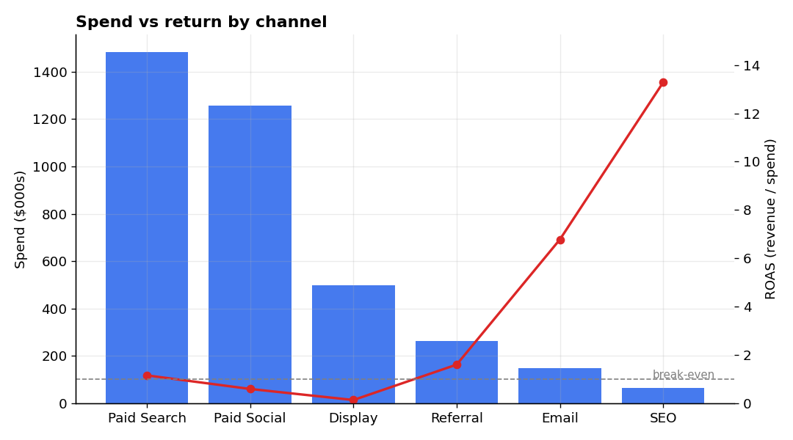
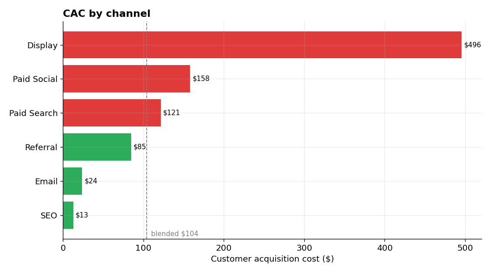
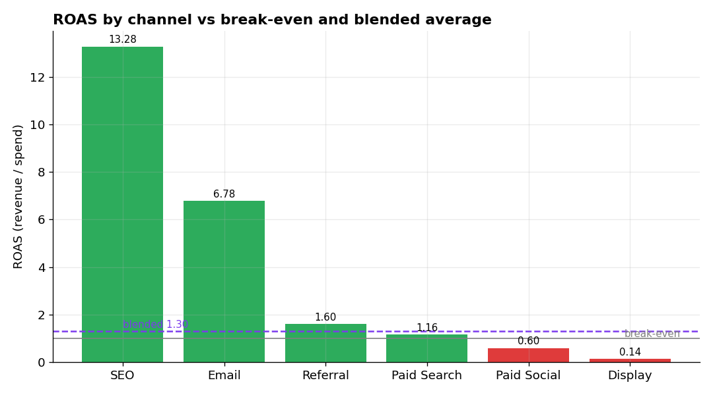
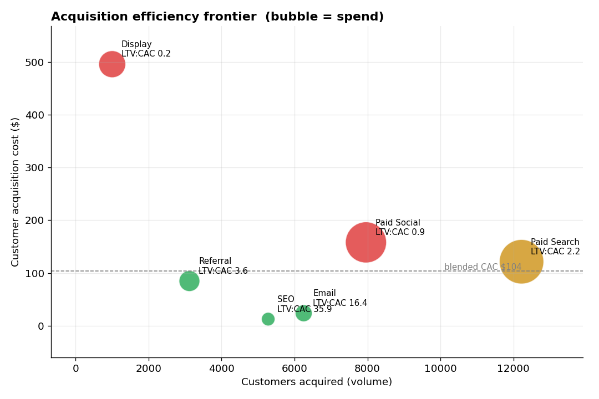
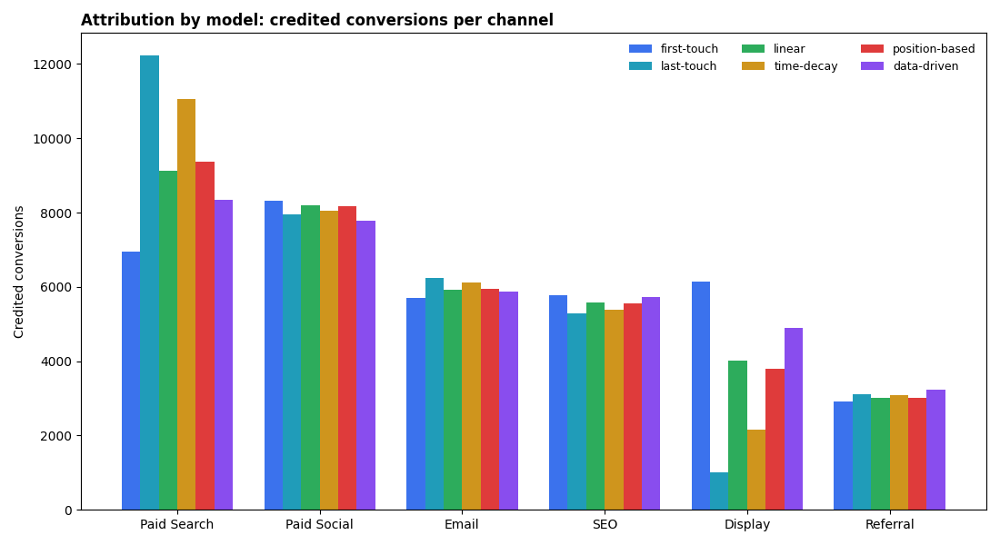
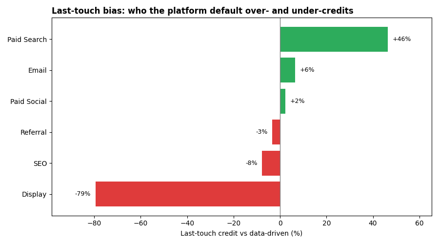

# Marketing Analytics & Attribution

End-to-end **marketing / growth analytics** on a realistic multi-market
acquisition dataset: channel performance, unit economics (CAC / ROAS / LTV),
multi-touch attribution, retention & payback, budget optimisation, anomaly
detection and experimentation — with the analysis run in both **Python** and
**SQL**, and an executive **Streamlit** dashboard on top.

The guiding principle is a commercial one: **optimise for revenue and payback,
not vanity metrics**. Every metric here ladders up to "where should the next
marketing dollar go?"

> Data is synthetic but fully reproducible (`generate_data.py`, fixed seed) and
> built with realistic economics — including a deliberately planted spend
> anomaly for the anomaly-detection work.

---

## The business

A subscription / affiliate business that acquires users across six channels
(**Paid Search, Paid Social, Display, Email, SEO, Referral**) in five markets
(**UK, US, DE, BR, IN**). Users who activate pay a recurring monthly commission,
so each channel has both an acquisition cost and a downstream lifetime value.

### Dataset (`data/`)

| Table | Grain | Key fields |
|-------|-------|-----------|
| `spend.csv` | day × channel × country × campaign | spend, impressions, clicks |
| `users.csv` | one acquired user | signup date, country, channel, converted, months_active, commission_revenue, ltv |
| `touchpoints.csv` | one marketing touch | user_id, seq, channel, touch_date |

Users are generated **from** the paid clicks, so cost-per-acquisition and ROAS
are internally consistent rather than arbitrary.

---

## Day 1 — Channel performance (Objective 1)

*Where is the money going, and what is it bringing back?*




**Channel summary** (full year — see [`images/channel_summary.csv`](images/channel_summary.csv)):

| Channel | Spend | Customers | CAC | Revenue | ROAS |
|---|--:|--:|--:|--:|--:|
| SEO | $66k | 5,279 | $13 | $882k | **13.3** |
| Email | $149k | 6,252 | $24 | $1.01m | **6.8** |
| Referral | $264k | 3,120 | $85 | $424k | 1.6 |
| Paid Search | $1.48m | 12,223 | $121 | $1.72m | 1.16 |
| Paid Social | $1.26m | 7,959 | $158 | $749k | 0.60 |
| Display | $497k | 1,003 | $496 | $69k | 0.14 |

**Blended:** ~$3.7m spend → ~$4.8m revenue, **1.30 ROAS**, ~$104 CAC across 35.8k paying customers.

**What stands out**

- **The budget is upside-down.** The two highest-return channels — SEO (13.3×)
  and Email (6.8×) — receive under 6% of spend combined, while Display and Paid
  Social (both below the 1.0 break-even line) absorb nearly half of it.
- **Display is loss-making**: a $496 CAC against a ~$90 lifetime value. A clear
  pause / rework candidate (revisited on Day 5).
- **Paid Social underperforms (0.60 ROAS)** — and part of that is a Brazil spend
  spike that never converted, surfaced later by the Day 5 anomaly detector.
- **Paid Search is the workhorse**: the largest volume of customers, at an
  acceptable-but-thin 1.16 ROAS — a margin-optimisation opportunity, not a cut.
- By market, **US and UK** clear break-even comfortably while **BR and IN** sit
  below it — a multi-market efficiency gap to unpack.

The same analysis is expressed in SQL in [`sql/queries.sql`](sql/queries.sql)
(run via `sql_analysis.py`), with results saved to `sql_output/`.

---

## Day 2 — Unit economics (Objective 2)

*What does a customer cost, what are they worth, and where is that math broken?*

Building on Day 1, `unit_economics.py` adds the metrics a growth team steers on —
**CAC, ROAS, ARPC** (avg revenue per customer) and **LTV:CAC** — cut by channel,
by market, and by channel × market, each benchmarked against the blended average.
The same views are defined in SQL ([`sql/unit_economics_views.sql`](sql/unit_economics_views.sql), run via `sql_views.py`).

**Unit economics by channel** (see [`images/unit_economics_by_channel.csv`](images/unit_economics_by_channel.csv)):

| Channel | Spend | Customers | CAC | ARPC | Avg LTV | LTV:CAC | ROAS |
|---|--:|--:|--:|--:|--:|--:|--:|
| SEO | $66k | 5,279 | $13 | $167 | $452 | **35.9** | 13.3 |
| Email | $149k | 6,252 | $24 | $161 | $391 | **16.4** | 6.8 |
| Referral | $264k | 3,120 | $85 | $136 | $307 | 3.6 | 1.6 |
| Paid Search | $1.48m | 12,223 | $121 | $140 | $272 | 2.2 | 1.16 |
| Paid Social | $1.26m | 7,959 | $158 | $94 | $142 | 0.9 | 0.60 |
| Display | $497k | 1,003 | $496 | $69 | $98 | **0.2** | 0.14 |

**Blended:** CAC ~$104 · ROAS 1.30 · **LTV:CAC 2.78**.




**What stands out**

- **Realised ROAS and lifetime LTV:CAC tell different stories — both matter.**
  Referral and Paid Search look marginal on realised ROAS (1.6 and 1.16) but
  clear a healthy LTV:CAC (3.6 and 2.2) once the *full* customer lifetime is
  counted. Judging paid channels on first-order ROAS alone would wrongly cut
  them; judging on LTV:CAC alone would ignore cash-flow timing (payback, Day 4).
- **The blended 1.30 ROAS is a mirage.** Four of six channels sit *below*
  break-even; the average is propped up by SEO and Email. A single blended KPI
  would completely hide where the money is actually made or lost.
- **The efficiency frontier frames the reallocation.** SEO and Email are cheap
  *and* healthy but low-volume (room to scale); Paid Search is the high-volume
  workhorse; Paid Social is a large, low-health spend; Display is a low-volume,
  loss-making dead-end.
- **Market gap:** US/UK acquire at ~$91–95 CAC and >3.5 LTV:CAC, while **BR and
  IN** run at $129–145 CAC and fall *below* a 1.0 LTV:CAC — losing money on
  every customer.
- **CAC hides in the cross-section.** The channel × market heatmap
  ([`images/cac_channel_country_heatmap.png`](images/cac_channel_country_heatmap.png))
  exposes the worst pockets — Display in India ($715) and Brazil ($644) — that a
  channel-only or market-only view averages away.

---

## Day 3 — Multi-touch attribution (Objective 2)

*Which channels actually deserve credit for a conversion — not just the last click?*

`attribution.py` credits each of the 35,836 converting journeys in
`touchpoints.csv` across **six models**: first-touch, last-touch, linear,
time-decay, position-based (U-shaped), and a **data-driven Markov removal
effect** that learns from non-converting paths too. Every model conserves the
total (35,836 conversions), so the columns are directly comparable.



**Share of credit by model** (%, see [`images/attribution_share_by_model.csv`](images/attribution_share_by_model.csv)):

| Channel | First | Last | Linear | Time-decay | Position | **Data-driven** |
|---|--:|--:|--:|--:|--:|--:|
| Paid Search | 19.4 | **34.1** | 25.5 | 30.8 | 26.1 | 23.3 |
| Paid Social | 23.2 | 22.2 | 22.9 | 22.4 | 22.8 | 21.7 |
| Email | 15.9 | 17.4 | 16.5 | 17.1 | 16.6 | 16.4 |
| SEO | 16.1 | 14.7 | 15.6 | 15.1 | 15.5 | 16.0 |
| Display | 17.1 | **2.8** | 11.2 | 6.0 | 10.6 | **13.6** |
| Referral | 8.2 | 8.7 | 8.4 | 8.6 | 8.4 | 9.0 |



**What stands out**

- **Last-touch is badly biased, and now we can quantify it.** Against the
  data-driven model it **over-credits Paid Search by +46%** (the closer) and
  **under-credits Display by −79%** (the opener). Optimising to last-touch would
  starve exactly the upper-funnel channel that starts journeys.
- **Display earns ~5× more credit under the data-driven model** (13.6% vs 2.8%).
  It rarely closes, but removing it from the graph collapses a lot of conversion
  paths — so it is an *assist* engine, not the dead weight last-touch implies.
  (Its economics still need fixing — that's a CAC problem, Day 2 — but the fix is
  "make the assists cheaper," not "switch it off blind.")
- **The data-driven model is the honest middle ground:** more generous to
  openers than last-touch, less credulous about closers than first-touch, and —
  unlike the rules-based models — grounded in how much each channel actually
  moves conversion probability.
- **Practical read:** judge closing channels (Paid Search) on last-touch and
  you overpay; judge assist channels (Display, Paid Social) on last-touch and you
  cut demand generation. The data-driven view is what should feed the Day 5
  budget-reallocation model.

The Markov model is a compact absorbing-chain implementation
([`attribution.py`](attribution.py) → `markov()`): build the transition matrix
`start → channels → (conv | null)`, then for each channel measure the drop in
`P(conversion)` when it is removed, and normalise those removal effects into
credit.

---

## Roadmap

| Day | Focus |
|-----|-------|
| **1** | **Data generation, SQL layer, channel performance** ✅ |
| **2** | **Unit economics — CAC / ROAS / LTV:CAC by channel & market, efficiency frontier** ✅ |
| **3** | **Attribution — first / last / linear / time-decay / position-based / data-driven (Markov)** ✅ |
| 4 | LTV, retention cohorts, payback period, LTV:CAC |
| 5 | Growth opportunities, anomaly detection, budget reallocation |
| 6 | CRO & experimentation — incrementality, geo-holdout lift, sample-size |
| 7 | Streamlit executive dashboard + written report |

---

## Tech stack

Python (pandas, numpy, matplotlib), SQL (SQLite), Streamlit + Plotly for the
dashboard, pytest for tests.

## Running it

```bash
python -m venv .venv && source .venv/bin/activate
pip install -r requirements.txt

python generate_data.py       # writes data/*.csv (reproducible, seeded)
python sql_analysis.py        # runs sql/queries.sql, writes sql_output/*.csv
python channel_performance.py # writes images/ charts + channel_summary.csv
```

## Repository layout

```
generate_data.py        synthetic dataset generator (spend, users, touchpoints)
channel_performance.py  Day 1 channel analysis + charts
unit_economics.py       Day 2 CAC / ROAS / LTV:CAC by channel, market & matrix
attribution.py          Day 3 six-model multi-touch attribution (incl. Markov)
sql_analysis.py         loads the CSVs into SQLite and runs the named queries
sql_views.py            builds the unit-economics SQL views and materialises them
sql/queries.sql         channel-performance SQL
sql/unit_economics_views.sql  reusable CAC / ROAS / LTV:CAC views
data/                   generated CSVs
sql_output/             SQL query results (CSV)
images/                 charts
tests/                  pytest suite (from Day 6)
```

---

*Author: Muhammad Nasiruddin*
